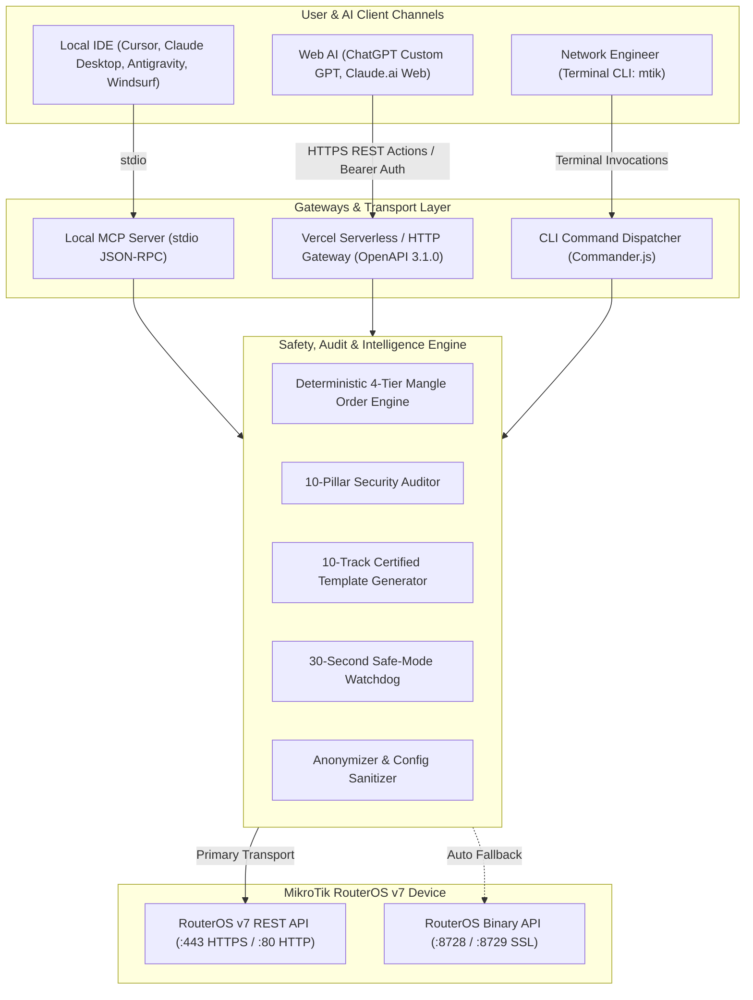
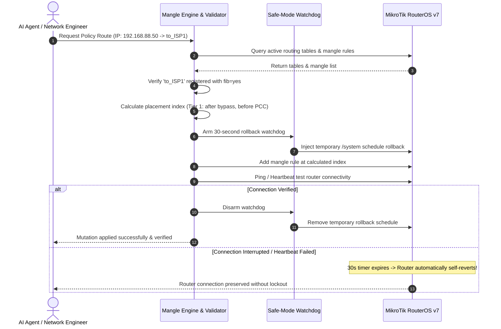

```text
  MMM      MMM       KKK                          TTTTTTTTTTT      KKK
  MMMM    MMMM       KKK                          TTTTTTTTTTT      KKK
  MMM MMMM MMM  III  KKK  KKK  RRRRRR     OOOOOO      TTT     III  KKK  KKK
  MMM  MM  MMM  III  KKKKK     RRR  RRR  OOO  OOO     TTT     III  KKKKK
  MMM      MMM  III  KKK KKK   RRRRRR    OOO  OOO     TTT     III  KKK KKK
  MMM      MMM  III  KKK  KKK  RRR  RRR   OOOOOO      TTT     III  KKK  KKK

  MikroTik RouterOS v7 Skill & Automation Toolkit (CLI & MCP Server)
```

# MikroTik RouterOS v7 Skill & CLI Toolkit

[](https://github.com/ardianryan/MikroTik-Skill/actions/workflows/ci.yml)
[](https://nodejs.org/)
[](https://www.typescriptlang.org/)
[](https://mikrotik.com/)
[](https://www.gnu.org/licenses/gpl-3.0)  
[%20%7C%20v7.24.4-059669?logo=mikrotik&logoColor=white)](https://mikrotik.com)
[%20%7C%20v7.23.7-059669?logo=mikrotik&logoColor=white)](https://mikrotik.com)
[](https://mikrotik.com)

> **Personal Daily Productivity & Network Automation Toolkit**  
> Authored by **Ardian Ryan** (<me@ardianryan.com>) to streamline network operations, multi-WAN load balancing, automated security auditing, and safe rule deployment on MikroTik RouterOS v7 devices.

---

## Advisory, Scope & Operational Philosophy

### Built to Assist, Not Replace Certified Engineers
This toolkit is built upon the architectural standards of the 10 official MikroTik certification tracks (MTCNA through MTCINE). However, **it is engineered as an assistive automation companion, not as a substitute for certified network engineers, professional on-site diagnostics, or experienced architectural judgment**.

While automation accelerates syntax generation, enforces deterministic mangle ordering, and audits configuration baselines, it does not replace the critical thinking of a qualified network engineer. Physical topology quirks, ISP peering agreements, and enterprise business context require human expertise. We encourage engineers to treat this toolkit as a powerful co-pilot: review every generated script, inspect dry-run diffs, and maintain responsible human oversight over all production decisions.

### RouterOS v7 Exclusivity
This toolkit is designed exclusively for **RouterOS v7 (v7.1+)**:
- **Modern Kernel Routing:** Requires explicit `/routing table` declarations with active `fib` flags.
- **REST API Subsystem:** Leverages native, structured JSON communications over HTTPS.
- **Next-Gen Modules:** Built for native CAKE/FQ-CoDel QoS, BGP connection templates, User Manager v7, and the modern `/interface wifi` subsystem.

*Legacy RouterOS v6 is not supported due to incompatible routing table syntax and the lack of a native REST API.*

### Safe Operational Best Practices
To maintain network reliability, the toolkit incorporates built-in guardrails:
1. **Lab Staging:** Validate multi-WAN and firewall mutations on virtual instances (such as MikroTik Cloud Hosted Router / CHR) prior to physical deployment.
2. **Visual Inspection (`--dry-run`):** Always preview proposed changes using colored visual diffs before applying them to physical hardware.
3. **Automated Rollback:** Utilize the integrated 30-second safe-mode watchdog to ensure self-reverting rollbacks if network reachability is disrupted.

---

## Overview

Managing MikroTik routers in multi-WAN environments often involves repetitive `.rsc` exports, delicate Mangle ordering, and the constant risk of lockout. 

**MikroTik Skill & CLI Toolkit** is a modular, type-safe automation suite designed to solve this. It provides both a powerful terminal CLI (`mtik`) and a Model Context Protocol (MCP) server (`mtik-mcp`) allowing AI coding assistants (such as Antigravity, Cursor, and Claude Desktop) to audit, inspect, and safely configure RouterOS v7 infrastructure with zero hallucinations.

---

## Key Features

- **Dual-Engine Connection:**
  - **Primary:** High-speed RouterOS v7 native REST API (`/rest`, HTTPS/HTTP) with structured JSON responses and self-signed certificate tolerance.
  - **Automatic Fallback:** Seamless fallback to RouterOS native binary API socket (Port 8728 / 8729 SSL) if WebFig or REST is disabled.
- **Automated 10-Pillar Security Audit:**
  - One-command audit evaluating DNS open resolvers, exposed administrative services, missing firewall input drops, IPv6 firewall parity, bridge STP loop protection, NTP clock drift, and Mangle Hairpin NAT leak risks.
- **Deterministic Mangle Order Engine:**
  - Prevents packet misrouting by enforcing the strict RouterOS hierarchy: **Bypass Rules** (`connection-nat-state=dstnat`, `LOCAL_BYPASS`) at index 0 → **Dedicated Client Overrides** → **PCC Load Balancing**.
- **FIB Integrity Validation:**
  - Verifies custom routing tables are declared in `/routing table` with `fib=yes` before any Mangle rule is injected.
- **30-Second Safe-Mode Watchdog:**
  - Automatically arms a temporary `/system schedule` rollback timer before critical changes. If connection is interrupted or unverified within 30 seconds, the router reverts the change automatically.
- **Auto-Sanitizer Export (`mtik backup --sanitize`):**
  - Exports structured JSON snapshots with automatic redaction of MAC addresses (`XX:XX:XX...`), serial numbers, passwords, shared secrets, and VPN network IDs—making exports 100% safe to share with AI or public forums.
- **Real-Time Terminal Bandwidth Monitor (`mtik monitor`):**
  - Live throughput meter in the terminal tracking RX/TX (Mbps/Kbps) across WAN and LAN interfaces.
- **Container & DNS Adlist Management:**
  - Inspect and restart local Docker microservices (`mtik container`) and manage network-wide adblocker feeds (`mtik adlist`).
- **Enterprise Reference Runbooks:**
  - Modular guides covering 802.1X/RADIUS (EAP-PEAP/TLS), Dynamic VLAN assignment, Modern CAKE/FQ-CoDel QoS, Captive Portal Walled Gardens, WireGuard Zero-Trust, and RouterOS v7 Docker containers.

---

## Architecture & How It Works

### 1. System Topology & Integration Gateways



### 2. Use Case Flow: Safe Mutation with 30s Watchdog Rollback



---

## Verified Hardware & Compatibility Matrix

This toolkit is continuously validated against physical MikroTik RouterOS v7 hardware across multiple processor architectures (ARM 32-bit, ARM64, and MMIPS):

| Device Model | Part Number | CPU & Architecture | RAM / Flash | Tested RouterOS | Primary Transport | Validation Status |
| :--- | :--- | :--- | :--- | :--- | :--- | :---: |
| **MikroTik hEX S (New Refresh)** | `E60iUGS` | **ARM** (MediaTek EN7562CT Dual-Core 950 MHz) | 512 MB / 128 MB | **v7.24.4** | REST API & Native API (:8728) | [](https://mikrotik.com) |
| **MikroTik hEX refresh** | `E50UG` | **ARM64** (MediaTek EN7562CT Dual-Core 950 MHz) | 512 MB / 128 MB | **v7.23.7** | REST API & Native API (:8728) | [](https://mikrotik.com) |
| **MikroTik RB1100AHx4** | `RB1100AHx4` | **ARM 32-bit** (Annapurna Alpine AL21400 Quad-Core 1.4 GHz) | 1 GB / 128 MB | **v7.23.7** | REST API & Native API (:8728) | [](https://mikrotik.com) |
| **MikroTik hEX S (Legacy)** | `RB760iGS` | **MMIPS** (MediaTek MT7621A Dual-Core 880 MHz) | 256 MB / 16 MB | **v7.24.4** | REST API & Native API (:8728) | [](https://mikrotik.com) |

> [!NOTE]
> **E60iUGS (hEX S 2024–2025) Architecture & Hardware Notes:**
> - **Firmware Package:** Download packages from the **ARM** category (32-bit), not ARM64.
> - **Port Topology:** `ether1` (PoE-in) connects directly to the CPU; ports `ether2`–`ether5` connect via the EN7562CT switch chip with full L2 Hardware Offload (`hw=yes`).
> - **Container Compatibility (`/container`):** When running Docker containers via external USB storage, images must target `linux/arm/v5` (`arm32v5`) instruction sets due to EN7562CT CPU capabilities to avoid `illegal instruction` errors.

---

## Installation & Setup

### 1. Requirements
- Node.js >= 20.0.0
- MikroTik Router running RouterOS v7.1 or higher

### 2. Quickstart
```bash
# Clone the repository
git clone https://github.com/ardianryan/MikroTik-Skill.git
cd MikroTik-Skill

# Install dependencies
npm install

# Build TypeScript
npm run build

# Link CLI globally to your terminal
npm link
```

### 3. Configure Credentials
Create a `.env` file in your working directory or project root:
```env
ROUTEROS_HOST=192.168.88.1
ROUTEROS_USER=admin
ROUTEROS_PASSWORD=your_secure_password

# Optional Port Overrides
ROUTEROS_REST_PORT=443
ROUTEROS_USE_SSL=true
ROUTEROS_API_PORT=8728
ROUTEROS_API_SSL_PORT=8729

# Optional API Key for Remote / Vercel / ChatGPT Action Gateway
MTIK_API_KEY=your_secret_api_token
```

---

## Integration Guide

Choose the integration method appropriate for your environment:

| Mode | Target Platform | Deployment Required? | Usage Model |
| :--- | :--- | :---: | :--- |
| **Local IDE** | Cursor, Claude Desktop, Antigravity, Windsurf | No | Runs locally via `stdio`. Connects to router over local network (`192.168.88.1`). |
| **Web AI (Prompt)** | ChatGPT Web, Claude.ai Web | No | Export instructions via `mtik prompt`, paste into Custom GPT/Claude Project. |
| **Web AI (Actions)** | ChatGPT Custom GPT Actions | Vercel Deploy | Deploy to Vercel to serve OpenAPI 3.1.0 knowledge endpoints without router credentials. |

### Local Desktop IDE (stdio)
1. Build the project:
   ```bash
   npm run build
   ```
2. Add the server configuration to your IDE's `mcp_config.json` or `claude_desktop_config.json`:
   ```json
   {
     "mcpServers": {
       "mikrotik": {
         "command": "node",
         "args": ["./dist/mcp/index.js"],
         "env": {
           "ROUTEROS_HOST": "192.168.88.1",
           "ROUTEROS_USER": "admin",
           "ROUTEROS_PASSWORD": "your_secure_password"
         }
       }
     }
   }
   ```
3. Your local AI assistant can now inspect router health, run audits, and safely mutate configurations.

---

### Web AI via Copy-Paste (ChatGPT & Claude.ai)
1. Export the certified engineer system prompt:
   ```bash
   mtik prompt -o mikrotik-system-prompt.md
   ```
2. Paste the contents into the **Instructions** field of your ChatGPT Custom GPT or Claude.ai Project.
3. The AI assistant generates standard `routeros` script blocks ready to paste directly into WinBox Terminal or execute via:
   ```bash
   mtik exec "<command-from-chatgpt>"
   ```

---

### Remote MCP & Web AI Gateway (`https://mikrotik-skill.vercel.app`)

You can connect your favorite AI IDEs and chat assistants directly to the hosted public Remote MCP and OpenAPI knowledge gateway without installing any software or configuring router credentials:

- **Gateway URL:** `https://mikrotik-skill.vercel.app`
- **Remote MCP SSE Endpoint:** `https://mikrotik-skill.vercel.app/sse`
- **OpenAPI 3.1.0 Specification:** `https://mikrotik-skill.vercel.app/openapi.json`

#### 1. Cursor IDE (`.cursor/mcp.json` or Settings > MCP)
```json
{
  "mcpServers": {
    "mikrotik": {
      "url": "https://mikrotik-skill.vercel.app/sse"
    }
  }
}
```

#### 2. Windsurf IDE (`~/.codeium/windsurf/mcp_config.json`)
```json
{
  "mcpServers": {
    "mikrotik": {
      "url": "https://mikrotik-skill.vercel.app/sse"
    }
  }
}
```

#### 3. Claude Desktop (`claude_desktop_config.json`)
```json
{
  "mcpServers": {
    "mikrotik": {
      "command": "npx",
      "args": ["-y", "mcp-remote", "https://mikrotik-skill.vercel.app/sse"]
    }
  }
}
```

#### 4. VS Code (Cline / Roo Code)
In Cline MCP Settings tab:
- **Server Name:** `mikrotik`
- **Type:** `sse`
- **URL:** `https://mikrotik-skill.vercel.app/sse`

#### 5. Claude Code CLI
```bash
claude mcp add --transport sse mikrotik https://mikrotik-skill.vercel.app/sse
```

#### 6. ChatGPT Custom GPT Actions
1. In Custom GPT Editor -> **Actions** -> **Create new action**.
2. Select **Import from URL** and enter:
   `https://mikrotik-skill.vercel.app/openapi.json`
3. Authentication: **None**. Save and publish.

---

## CLI Usage (`mtik`)

```bash
# Verify connectivity and active transport (REST vs Binary API)
mtik test

# Display system health, CPU utilization, and lease counters
mtik status

# Run automated 7-Pillar Security Audit
mtik audit

# List firewall mangle rules with index & hierarchy breakdown
mtik mangle

# Preview proposed route changes without applying (Dry-Run / Sandbox)
mtik route-force --ip 192.168.88.50 --table to_ISP1 --dry-run

# Safely force an internal IP to exit via a specific ISP table
mtik route-force --ip 192.168.88.50 --table to_ISP1 --comment "Dev Server Priority"

# Export sanitized configuration (all MACs, serials, passwords redacted)
mtik backup --sanitize

# Launch live interface throughput monitor
mtik monitor

# Manage Docker microservices on RouterOS v7 hardware
mtik container
mtik container --restart 0

# Inspect DNS adblocker feed lists
mtik adlist

# Manage multi-router profiles securely
mtik profile --save homelab
mtik profile

# Generate certified templates across all 10 MikroTik Certification tracks
mtik template --list
mtik template mtcswe --output mtcswe-switching.rsc

# Execute arbitrary RouterOS CLI scripts atomically
mtik exec "/ip/address/print"

# Query RouterOS v7 REST endpoints directly
mtik rest GET /system/resource

# Export optimized system prompt for ChatGPT Custom GPT or Claude.ai Project
mtik prompt
mtik prompt -o mikrotik-system-prompt.md
```

---

## AI Agent Integration (Model Context Protocol - MCP)

This repository includes a stdio MCP server (`mtik-mcp`) allowing AI coding assistants to invoke RouterOS tools safely.

### Cursor / Claude Desktop / Antigravity Config
Add this entry to your `mcp_config.json` or `claude_desktop_config.json`:

```json
{
  "mcpServers": {
    "mikrotik": {
      "command": "node",
      "args": ["./dist/mcp/index.js"],
      "env": {
        "ROUTEROS_HOST": "192.168.88.1",
        "ROUTEROS_USER": "admin",
        "ROUTEROS_PASSWORD": "your_secure_password",
        "ROUTEROS_REST_PORT": "443",
        "ROUTEROS_USE_SSL": "true"
      }
    }
  }
}
```

### Available Tools:
- `mikrotik_test_connection`: Test connectivity & transport detection.
- `mikrotik_get_system_status`: Inspect CPU, memory, uptime, and interfaces.
- `mikrotik_audit_security`: Execute 10-Pillar Security Audit.
- `mikrotik_list_mangle`: View mangle rules with hierarchy analysis.
- `mikrotik_force_routing`: Assign client IP to routing table with dry-run and watchdog protection.
- `mikrotik_manage_dhcp_lease`: List and add static DHCP leases.
- `mikrotik_export_sanitized_config`: Export anonymized configuration for safe AI analysis.
- `mikrotik_manage_container`: List and restart Docker containers.
- `mikrotik_get_adlist_status`: Query active DNS adblocker feeds.
- `mikrotik_generate_template`: Generate certified configurations for all 10 MikroTik tracks (MTCNA, MTCRE, MTCINE, MTCSWE, MTCTCE, MTCSE, MTCIPv6E, MTCUME, MTCEWE, MTCWE).
- `mikrotik_execute_command`: Atomically execute arbitrary RouterOS CLI commands or scripts.
- `mikrotik_rest_query`: Query RouterOS v7 `/rest/<endpoint>` with GET, POST, PUT, PATCH, DELETE.
- `mikrotik_get_chat_prompt`: Retrieve senior engineer prompt for ChatGPT and Claude.ai.

---

## Enterprise Documentation & Runbooks

Deep-dive technical runbooks are available in [`.agents/skills/mikrotik/references/`](./.agents/skills/mikrotik/references/):

| Runbook | Description |
| :--- | :--- |
| [Enterprise 802.1X / RADIUS](./.agents/skills/mikrotik/references/radius-8021x.md) | WPA2/WPA3-Enterprise, local CA generation, and Dynamic VLAN assignment. |
| [Captive Portal & Walled Garden](./.agents/skills/mikrotik/references/hotspot-portal.md) | Mobile-first HTML5 login portal and OAuth/Payment Gateway whitelisting. |
| [Modern CAKE QoS](./.agents/skills/mikrotik/references/qos-cake.md) | Anti-bufferbloat queuing and DSCP voice/interactive prioritization. |
| [WireGuard Zero-Trust VPN](./.agents/skills/mikrotik/references/wireguard-vpn.md) | High-speed remote access tunnels and peer key management. |
| [Docker Containers on RouterOS v7](./.agents/skills/mikrotik/references/docker-containers.md) | Deploying AdGuard Home, Cloudflare Tunnel, and Tailscale on router hardware. |

---

## Development & Testing

```bash
# Run strict TypeScript typechecking
npm run typecheck

# Run automated unit tests
npm test

# Build production artifacts
npm run build
```

---

## Security & Vulnerability Reporting

Please report security issues directly to **Ardian Ryan** at **[me@ardianryan.com](mailto:me@ardianryan.com)**.  
See [SECURITY.md](./SECURITY.md) for vulnerability disclosure procedures.

---

## License

Released under the **[GNU General Public License v3.0 (GPL-3.0)](./LICENSE)**.  
Copyright (c) 2026 Ardian Ryan <me@ardianryan.com>.
