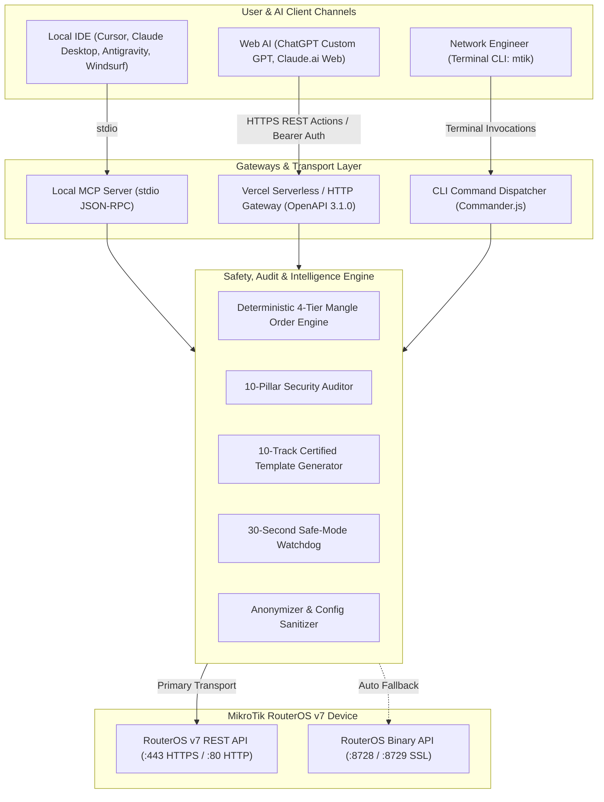
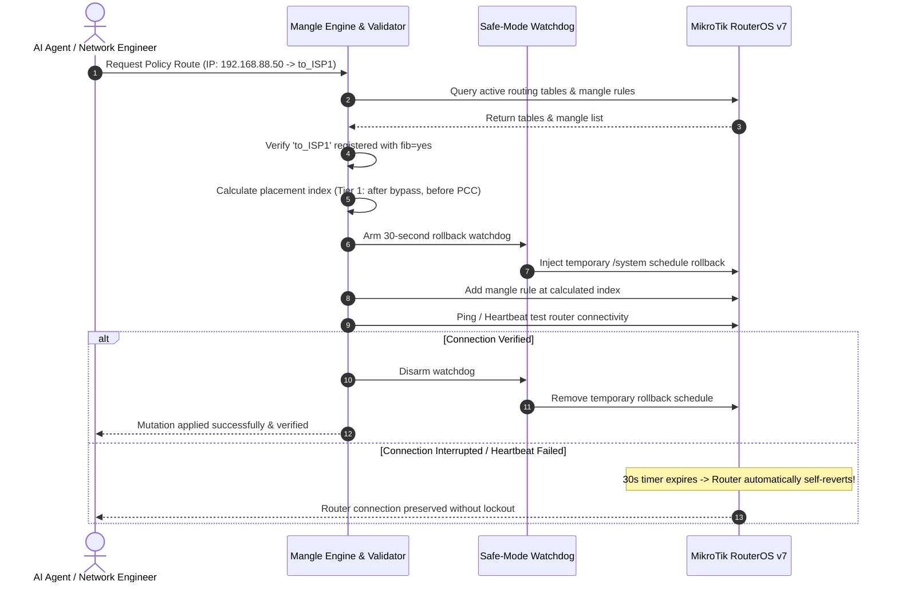

```text
  MMM      MMM       KKK                          TTTTTTTTTTT      KKK
  MMMM    MMMM       KKK                          TTTTTTTTTTT      KKK
  MMM MMMM MMM  III  KKK  KKK  RRRRRR     OOOOOO      TTT     III  KKK  KKK
  MMM  MM  MMM  III  KKKKK     RRR  RRR  OOO  OOO     TTT     III  KKKKK
  MMM      MMM  III  KKK KKK   RRRRRR    OOO  OOO     TTT     III  KKK KKK
  MMM      MMM  III  KKK  KKK  RRR  RRR   OOOOOO      TTT     III  KKK  KKK

  MikroTik RouterOS v7 NetDevOps Toolkit & MCP Server
```

# MikroTik RouterOS v7 NetDevOps Toolkit & MCP Server

[](https://github.com/ardianryan/MikroTik-Skill/actions/workflows/ci.yml)
[](https://www.npmjs.com/package/mikrotik-skill)
[](https://github.com/users/ardianryan/packages/npm/package/mikrotik-skill)
[](https://nodejs.org/)
[](https://www.typescriptlang.org/)
[](https://mikrotik.com/)
[](https://www.gnu.org/licenses/gpl-3.0)  
[%20%7C%20v7.24.4-059669?logo=mikrotik&logoColor=white)](https://mikrotik.com)
[%20%7C%20v7.23.7-059669?logo=mikrotik&logoColor=white)](https://mikrotik.com)
[](https://mikrotik.com)

> **Enterprise-Grade NetDevOps CLI, Model Context Protocol (MCP) Server, and AI Engineering Suite for MikroTik RouterOS v7**  
> Authored by **Ardian Ryan** (<me@ardianryan.com>) to streamline network operations, multi-WAN load balancing, automated security auditing, captive portal generation, and safe rule deployment on physical RouterOS v7 hardware.

---

## Advisory, Scope & Operational Philosophy

### Built to Assist, Not Replace Certified Engineers
This toolkit is built upon the architectural standards of the 10 official MikroTik certification tracks (MTCNA through MTCINE). However, **it is engineered as an assistive automation companion, not as a substitute for certified network engineers, professional on-site diagnostics, or experienced architectural judgment**.

While automation accelerates syntax generation, enforces deterministic mangle ordering, and audits configuration baselines, it does not replace the critical thinking of a qualified network engineer. Physical topology quirks, ISP peering agreements, and enterprise business context require human expertise. We encourage engineers to treat this toolkit as a powerful co-pilot: review every generated script, inspect dry-run diffs, and maintain responsible human oversight over all production decisions.

### RouterOS v7 Exclusivity
This toolkit is designed exclusively for **RouterOS v7 (v7.1+)**:
- **Modern Kernel Routing:** Requires explicit `/routing table` declarations with active `fib` flags.
- **REST API Subsystem:** Leverages native, structured JSON communications over HTTPS.
- **Next-Gen Modules:** Built for native CAKE/FQ-CoDel QoS, BGP connection templates, User Manager v7, and the modern `/interface wifi` subsystem.

*Legacy RouterOS v6 is not supported due to incompatible routing table syntax and the lack of a native REST API.*

### Safe Operational Best Practices
To maintain network reliability, the toolkit incorporates built-in guardrails:
1. **Lab Staging:** Validate multi-WAN and firewall mutations on virtual instances (such as MikroTik Cloud Hosted Router / CHR) prior to physical deployment.
2. **Visual Inspection (`--dry-run`):** Always preview proposed changes using colored visual diffs before applying them to physical hardware.
3. **Automated Rollback:** Utilize the integrated 30-second safe-mode watchdog to ensure self-reverting rollbacks if network reachability is disrupted.

---

## Overview

Managing MikroTik routers in multi-WAN environments often involves repetitive `.rsc` exports, delicate Mangle ordering, and the constant risk of lockout.

**MikroTik NetDevOps Toolkit & MCP Server** is a comprehensive, production-grade automation ecosystem engineered for both human engineers and AI coding assistants:

1. **Autonomous CLI Toolkit (`mtik`)**: Execute audits, monitor bandwidth, inspect fleet inventory, manage PoE, and generate configurations directly from terminal or CI/CD pipelines. Available zero-install via `npx mikrotik-skill`.
2. **Model Context Protocol (MCP) Server (`mtik-mcp`)**: Native stdio and remote SSE server equipping AI coding assistants (Antigravity, Cursor, Windsurf, Claude Desktop, VS Code) with 22 validated tools to safely inspect and automate RouterOS v7 without hallucinations.
3. **Interactive Web Workbench & REST Gateway**: Dark-titanium browser studio featuring an interactive Captive Hotspot Portal Studio, WireGuard QR Code Generator, Asymmetric PCC Calculator, and OpenAPI 3.1.0 serverless endpoints.
4. **Certified AI Knowledge Engine (The Brain)**: 20+ specialized runbooks, hardware architecture matrices, and kernel rules residing in `.agents/skills/mikrotik/` providing exact grounding for AI pair programming.

---

## Key Features

- **Interactive Fullscreen TUI Dashboard (`mtik tui` / `mtik`):**
  - Fullscreen terminal interface with dual-pane layout: live hardware gauges (E60iUGS/ARM/MMIPS CPU & Memory), interface overview, and step-by-step interactive configuration wizards (Multi-WAN PCC, WireGuard QR, Hotspot Portals, and 10-Pillar Security Audit). Runs automatically in interactive terminals!
- **Dual-Engine Connection:**
  - **Primary:** High-speed RouterOS v7 native REST API (`/rest`, HTTPS/HTTP) with structured JSON responses and self-signed certificate tolerance.
  - **Automatic Fallback:** Seamless fallback to RouterOS native binary API socket (Port 8728 / 8729 SSL) if WebFig or REST is disabled.
- **Automated 10-Pillar Security Audit:**
  - One-command audit evaluating DNS open resolvers, exposed administrative services, missing firewall input drops, IPv6 firewall parity, bridge STP loop protection, NTP clock drift, and Mangle Hairpin NAT leak risks.
- **Deterministic Mangle Order Engine:**
  - Prevents packet misrouting by enforcing the strict RouterOS hierarchy: **Bypass Rules** (`connection-nat-state=dstnat`, `LOCAL_BYPASS`) at index 0 → **Dedicated Client Overrides** → **PCC Load Balancing**.
- **FIB Integrity Validation:**
  - Verifies custom routing tables are declared in `/routing table` with `fib=yes` before any Mangle rule is injected.
- **30-Second Safe-Mode Watchdog:**
  - Automatically arms a temporary `/system schedule` rollback timer before critical changes. If connection is interrupted or unverified within 30 seconds, the router reverts the change automatically.
- **Auto-Sanitizer Export (`mtik backup --sanitize`):**
  - Exports structured JSON snapshots with automatic redaction of MAC addresses (`XX:XX:XX...`), serial numbers, passwords, shared secrets, and VPN network IDs—making exports 100% safe to share with AI or public forums.
- **Real-Time Terminal Bandwidth Monitor (`mtik monitor`):**
  - Live throughput meter in the terminal tracking RX/TX (Mbps/Kbps) across WAN and LAN interfaces.
- **Container & DNS Adlist Management:**
  - Inspect and restart local Docker microservices (`mtik container`) and manage network-wide adblocker feeds (`mtik adlist`).
- **Enterprise Reference Runbooks:**
  - Modular guides covering 802.1X/RADIUS (EAP-PEAP/TLS), Dynamic VLAN assignment, Modern CAKE/FQ-CoDel QoS, Captive Portal Walled Gardens, WireGuard Zero-Trust, and RouterOS v7 Docker containers.

---

## Architecture & How It Works

### 1. System Topology & Integration Gateways


```mermaid
flowchart TD
    subgraph Clients ["User & AI Client Channels"]
        U1["Local IDE (Cursor, Claude Desktop, Antigravity, Windsurf)"]
        U2["Web AI (ChatGPT Custom GPT, Claude.ai Web)"]
        U3["Network Engineer (Terminal CLI: mtik)"]
    end

    subgraph Gateways ["Gateways & Transport Layer"]
        G1["Local MCP Server (stdio JSON-RPC)"]
        G2["Vercel Serverless / HTTP Gateway (OpenAPI 3.1.0)"]
        G3["CLI Command Dispatcher (Commander.js)"]
    end

    subgraph Engine ["Safety, Audit & Intelligence Engine"]
        E1["Deterministic 4-Tier Mangle Order Engine"]
        E2["10-Pillar Security Auditor"]
        E3["10-Track Certified Template Generator"]
        E4["30-Second Safe-Mode Watchdog"]
        E5["Anonymizer & Config Sanitizer"]
    end

    subgraph RouterOS ["MikroTik RouterOS v7 Device"]
        R1["RouterOS v7 REST API (:443 HTTPS / :80 HTTP)"]
        R2["RouterOS Binary API (:8728 / :8729 SSL)"]
    end

    U1 -->|stdio| G1
    U2 -->|HTTPS REST Actions / Bearer Auth| G2
    U3 -->|Terminal Invocations| G3

    G1 --> Engine
    G2 --> Engine
    G3 --> Engine

    Engine -->|Primary Transport| R1
    Engine -.->|Auto Fallback| R2
```

### 2. Use Case Flow: Safe Mutation with 30s Watchdog Rollback


```mermaid
sequenceDiagram
    autonumber
    actor Engineer as AI Agent / Network Engineer
    participant Engine as Mangle Engine & Validator
    participant Watchdog as Safe-Mode Watchdog
    participant Router as MikroTik RouterOS v7

    Engineer->>Engine: Request Policy Route (IP: 192.168.88.50 -> to_ISP1)
    Engine->>Router: Query active routing tables & mangle rules
    Router-->>Engine: Return tables & mangle list
    Engine->>Engine: Verify 'to_ISP1' registered with fib=yes
    Engine->>Engine: Calculate placement index (Tier 1: after bypass, before PCC)
    Engine->>Watchdog: Arm 30-second rollback watchdog
    Watchdog->>Router: Inject temporary /system schedule rollback
    Engine->>Router: Add mangle rule at calculated index
    Engine->>Router: Ping / Heartbeat test router connectivity
    alt Connection Verified
        Engine->>Watchdog: Disarm watchdog
        Watchdog->>Router: Remove temporary rollback schedule
        Engine-->>Engineer: Mutation applied successfully & verified
    else Connection Interrupted / Heartbeat Failed
        Note over Router: 30s timer expires -> Router automatically self-reverts!
        Router-->>Engineer: Router connection preserved without lockout
    end
```

---

## Verified Hardware & Compatibility Matrix

This toolkit is continuously validated against physical MikroTik RouterOS v7 hardware across multiple processor architectures (ARM 32-bit, ARM64, and MMIPS):

| Device Model | Part Number | CPU & Architecture | RAM / Flash | Tested RouterOS | Primary Transport | Validation Status |
| :--- | :--- | :--- | :--- | :--- | :--- | :---: |
| **MikroTik hEX S (New Refresh)** | `E60iUGS` | **ARM** (MediaTek EN7562CT Dual-Core 950 MHz) | 512 MB / 128 MB | **v7.24.4** | REST API & Native API (:8728) | [](https://mikrotik.com) |
| **MikroTik hEX refresh** | `E50UG` | **ARM64** (MediaTek EN7562CT Dual-Core 950 MHz) | 512 MB / 128 MB | **v7.23.7** | REST API & Native API (:8728) | [](https://mikrotik.com) |
| **MikroTik RB1100AHx4** | `RB1100AHx4` | **ARM 32-bit** (Annapurna Alpine AL21400 Quad-Core 1.4 GHz) | 1 GB / 128 MB | **v7.23.7** | REST API & Native API (:8728) | [](https://mikrotik.com) |
| **MikroTik hEX S (Legacy)** | `RB760iGS` | **MMIPS** (MediaTek MT7621A Dual-Core 880 MHz) | 256 MB / 16 MB | **v7.24.4** | REST API & Native API (:8728) | [](https://mikrotik.com) |

> [!NOTE]
> **E60iUGS (hEX S 2024–2025) Architecture & Hardware Notes:**
> - **Firmware Package:** Download packages from the **ARM** category (32-bit), not ARM64.
> - **Port Topology:** `ether1` (PoE-in) connects directly to the CPU; ports `ether2`–`ether5` connect via the EN7562CT switch chip with full L2 Hardware Offload (`hw=yes`).
> - **Container Compatibility (`/container`):** When running Docker containers via external USB storage, images must target `linux/arm/v5` (`arm32v5`) instruction sets due to EN7562CT CPU capabilities to avoid `illegal instruction` errors.

---

## Installation & Setup

### 1. Requirements
- Node.js >= 20.0.0
- MikroTik Router running RouterOS v7.1 or higher (or use offline knowledge generators)

### 2. Quickstart

#### Option A: Zero-Install Execution (via npx)
Run any command or launch local tools instantly without cloning:
```bash
# Display router status & health
npx mikrotik-skill status

# Generate high-conversion Captive Hotspot Portal
npx mikrotik-skill hotspot --type all-in-one --org "Enterprise Guest"

# Generate asymmetric PCC load balancing script
npx mikrotik-skill pcc --wan "ISP1:100,ISP2:50"

# Boot stdio MCP server for IDEs
npx mikrotik-skill mcp
```

#### Option B: Global Terminal Installation
```bash
npm install -g mikrotik-skill

# Run anywhere with short command `mtik`
mtik status
mtik audit
```

#### Option C: Build from Source
```bash
git clone https://github.com/ardianryan/MikroTik-Skill.git
cd MikroTik-Skill
npm install
npm run build
npm link
```

### 3. Configure Credentials
Create a `.env` file in your working directory or project root:
```env
ROUTEROS_HOST=192.168.88.1
ROUTEROS_USER=admin
ROUTEROS_PASSWORD=your_secure_password

# Optional Port Overrides
ROUTEROS_REST_PORT=443
ROUTEROS_USE_SSL=true
ROUTEROS_API_PORT=8728
ROUTEROS_API_SSL_PORT=8729

# Optional API Key for Remote / Vercel / ChatGPT Action Gateway
MTIK_API_KEY=your_secret_api_token
```

---

## Integration Guide

Choose the integration method appropriate for your environment:

| Mode | Target Platform | Deployment Required? | Usage Model |
| :--- | :--- | :---: | :--- |
| **Local IDE** | Cursor, Claude Desktop, Antigravity, Windsurf | No | Runs locally via `stdio`. Connects to router over local network (`192.168.88.1`). |
| **Web AI (Prompt)** | ChatGPT Web, Claude.ai Web | No | Export instructions via `mtik prompt`, paste into Custom GPT/Claude Project. |
| **Web AI (Actions)** | ChatGPT Custom GPT Actions | Vercel Deploy | Deploy to Vercel to serve OpenAPI 3.1.0 knowledge endpoints without router credentials. |

### Local Desktop IDE (stdio)
1. Build the project:
   ```bash
   npm run build
   ```
2. Add the server configuration to your IDE's `mcp_config.json` or `claude_desktop_config.json`:
   ```json
   {
     "mcpServers": {
       "mikrotik": {
         "command": "node",
         "args": ["./dist/mcp/index.js"],
         "env": {
           "ROUTEROS_HOST": "192.168.88.1",
           "ROUTEROS_USER": "admin",
           "ROUTEROS_PASSWORD": "your_secure_password"
         }
       }
     }
   }
   ```
3. Your local AI assistant can now inspect router health, run audits, and safely mutate configurations.

---

### Web AI via Copy-Paste (ChatGPT & Claude.ai)
1. Export the certified engineer system prompt:
   ```bash
   mtik prompt -o mikrotik-system-prompt.md
   ```
2. Paste the contents into the **Instructions** field of your ChatGPT Custom GPT or Claude.ai Project.
3. The AI assistant generates standard `routeros` script blocks ready to paste directly into WinBox Terminal or execute via:
   ```bash
   mtik exec "<command-from-chatgpt>"
   ```

---

### Remote MCP & Web AI Gateway (`https://mikrotik-skill.vercel.app`)

You can connect your favorite AI IDEs and chat assistants directly to the hosted public Remote MCP and OpenAPI knowledge gateway without installing any software or configuring router credentials:

- **Gateway URL:** `https://mikrotik-skill.vercel.app`
- **Remote MCP SSE Endpoint:** `https://mikrotik-skill.vercel.app/sse`
- **OpenAPI 3.1.0 Specification:** `https://mikrotik-skill.vercel.app/openapi.json`

#### 1. Cursor IDE (`.cursor/mcp.json` or Settings > MCP)
```json
{
  "mcpServers": {
    "mikrotik": {
      "url": "https://mikrotik-skill.vercel.app/sse"
    }
  }
}
```

#### 2. Windsurf IDE (`~/.codeium/windsurf/mcp_config.json`)
```json
{
  "mcpServers": {
    "mikrotik": {
      "url": "https://mikrotik-skill.vercel.app/sse"
    }
  }
}
```

#### 3. Claude Desktop (`claude_desktop_config.json`)
```json
{
  "mcpServers": {
    "mikrotik": {
      "command": "npx",
      "args": ["-y", "mcp-remote", "https://mikrotik-skill.vercel.app/sse"]
    }
  }
}
```

#### 4. VS Code (Cline / Roo Code)
In Cline MCP Settings tab:
- **Server Name:** `mikrotik`
- **Type:** `sse`
- **URL:** `https://mikrotik-skill.vercel.app/sse`

#### 5. Claude Code CLI
```bash
claude mcp add --transport sse mikrotik https://mikrotik-skill.vercel.app/sse
```

#### 6. ChatGPT Custom GPT Actions
1. In Custom GPT Editor -> **Actions** -> **Create new action**.
2. Select **Import from URL** and enter:
   `https://mikrotik-skill.vercel.app/openapi.json`
3. Authentication: **None**. Save and publish.

---

## CLI Usage (`mtik`)

```bash
# Launch interactive Fullscreen TUI Dashboard & Wizards (or run `mtik` directly)
mtik tui
mtik ui

# Verify connectivity and active transport (REST vs Binary API)
mtik test

# Display system health, CPU utilization, and lease counters
mtik status

# Run automated 10-Pillar Security Audit
mtik audit

# Generate high-conversion Captive Hotspot Portal bundle
mtik hotspot --type all-in-one --org "Guest Lounge" --currency "IDR"

# Provision Curve25519 WireGuard client with terminal QR code
mtik wireguard --client-ip 10.10.0.2/32 --listen-port 13231

# Calculate asymmetric Multi-WAN PCC load balancing script
mtik pcc --wan "ISP1:100,ISP2:50" --lan "bridge-lan"

# Lint RouterOS configuration script (.rsc) for security and syntax risks
mtik lint -f /path/to/backup.rsc

# Transpile legacy RouterOS v6 routing filters to modern v7 syntax
mtik migrate-filter -f /path/to/v6-filters.rsc

# Fleet Inventory: list and manage multi-router profiles
mtik devices
mtik inventory

# Power-cycle PoE port and inspect real-time wattage / voltage
mtik poe ether5 --cycle

# Real-time log triage and security forensic inspection
mtik logs --topic firewall --limit 50

# Deploy CAKE SQM anti-bufferbloat queues
mtik queue --interface ether1 --upload 50M --download 100M

# Inspect connected wireless clients and signal telemetry
mtik wifi --clients

# List firewall mangle rules with index & hierarchy breakdown
mtik mangle

# Preview proposed route changes without applying (Dry-Run / Sandbox)
mtik route-force --ip 192.168.88.50 --table to_ISP1 --dry-run

# Safely force an internal IP to exit via a specific ISP table
mtik route-force --ip 192.168.88.50 --table to_ISP1 --comment "Dev Server Priority"

# Export sanitized configuration (all MACs, serials, passwords redacted)
mtik backup --sanitize

# Launch live interface throughput monitor
mtik monitor

# Manage Docker microservices on RouterOS v7 hardware
mtik container
mtik container --restart 0

# Inspect DNS adblocker feed lists
mtik adlist

# Automatically install MCP server configuration into your local IDEs
mtik mcp install

# Generate certified templates across all 10 MikroTik Certification tracks
mtik template --list
mtik template mtcswe --output mtcswe-switching.rsc

# Execute arbitrary RouterOS CLI scripts atomically
mtik exec "/ip/address/print"

# Query RouterOS v7 REST endpoints directly
mtik rest GET /system/resource

# Export optimized system prompt for ChatGPT Custom GPT or Claude.ai Project
mtik prompt
mtik prompt -o mikrotik-system-prompt.md
```

---

## AI Agent Integration (Model Context Protocol - MCP)

This repository includes a production Model Context Protocol (MCP) server (`mtik-mcp`) allowing AI coding assistants to inspect, audit, and configure RouterOS v7 infrastructure safely.

### Cursor / Claude Desktop / Antigravity / Windsurf Config

#### Option A: Zero-Install NPX (Recommended)
Add this entry to your `mcp_config.json` or `claude_desktop_config.json`:
```json
{
  "mcpServers": {
    "mikrotik": {
      "command": "npx",
      "args": ["-y", "mikrotik-skill", "mcp"],
      "env": {
        "ROUTEROS_HOST": "192.168.88.1",
        "ROUTEROS_USER": "admin",
        "ROUTEROS_PASSWORD": "your_secure_password",
        "ROUTEROS_REST_PORT": "443",
        "ROUTEROS_USE_SSL": "true"
      }
    }
  }
}
```

#### Option B: Local Repository Build
```json
{
  "mcpServers": {
    "mikrotik": {
      "command": "node",
      "args": ["./dist/mcp/index.js"],
      "env": {
        "ROUTEROS_HOST": "192.168.88.1",
        "ROUTEROS_USER": "admin",
        "ROUTEROS_PASSWORD": "your_secure_password"
      }
    }
  }
}
```

### Complete MCP Tools Registry (22 Tools):

| Tool | Category | Description |
| :--- | :--- | :--- |
| `mikrotik_test_connection` | Diagnostic | Test connectivity and detect active transport (REST vs Binary API). |
| `mikrotik_get_system_status` | Telemetry | Inspect CPU load, memory, disk, uptime, and interface states. |
| `mikrotik_audit_security` | Security | Run comprehensive 10-Pillar Security Audit with actionable findings. |
| `mikrotik_list_mangle` | Traffic Control | View firewall mangle rules with strict hierarchy ordering analysis. |
| `mikrotik_force_routing` | Routing | Assign client IP to routing table with visual dry-run and 30s watchdog. |
| `mikrotik_calculate_pcc` | Traffic Control | Compute mathematically sound PCC mangle and routing rules for asymmetric WANs. |
| `mikrotik_provision_wireguard` | VPN | Generate Curve25519 keypairs, client configs, router commands, and ASCII QR codes. |
| `mikrotik_generate_hotspot_portal` | Hotspot | Generate mobile-first captive portal bundles (voucher, user/pass, social, trial, QRIS). |
| `mikrotik_migrate_filter` | Migration | Transpile legacy RouterOS v6 routing filters into v7 syntax. |
| `mikrotik_lint_config` | Validation | Deterministic linter detecting plaintext secrets, open DNS, and inverted rules. |
| `mikrotik_manage_dhcp_lease` | IP Services | Query and add static DHCP leases with MAC reservations. |
| `mikrotik_export_sanitized_config` | Safety | Export anonymized configuration (redacting MACs, serials, passwords) for AI analysis. |
| `mikrotik_manage_container` | Microservices | Inspect and restart Docker container instances on RouterOS hardware. |
| `mikrotik_get_adlist_status` | DNS Security | Query active DNS adblocker feed lists and block counters. |
| `mikrotik_generate_template` | Knowledge | Generate certified configurations across all 10 MikroTik Certification tracks. |
| `mikrotik_list_devices` | Fleet | List and query multi-router profiles from YAML/JSON fleet inventory. |
| `mikrotik_get_logs` | Forensics | Query live router system logs with topic-specific filtering (`firewall`, `warning`, etc.). |
| `mikrotik_manage_poe` | Hardware | Inspect PoE wattage/voltage and power-cycle connected appliances. |
| `mikrotik_manage_queues` | QoS | Deploy and manage low-latency CAKE / FQ-CoDel anti-bufferbloat queues. |
| `mikrotik_get_wireless_clients` | Wireless | Query connected Wi-Fi clients, signal strength (RSSI), and PHY rates. |
| `mikrotik_execute_command` | Execution | Atomically execute arbitrary RouterOS CLI commands. |
| `mikrotik_rest_query` | REST Client | Query RouterOS v7 `/rest/<endpoint>` with GET, POST, PUT, PATCH, DELETE. |
| `mikrotik_get_chat_prompt` | Knowledge | Retrieve senior network engineer system prompt for ChatGPT and Claude.ai. |

---

## Enterprise Documentation & Runbooks

Deep-dive technical runbooks are available in [`.agents/skills/mikrotik/references/`](./.agents/skills/mikrotik/references/):

| Runbook | Description |
| :--- | :--- |
| [Enterprise 802.1X / RADIUS](./.agents/skills/mikrotik/references/radius-8021x.md) | WPA2/WPA3-Enterprise, local CA generation, and Dynamic VLAN assignment. |
| [Captive Portal & Walled Garden](./.agents/skills/mikrotik/references/hotspot-portal.md) | Mobile-first HTML5 login portal and OAuth/Payment Gateway whitelisting. |
| [Modern CAKE QoS](./.agents/skills/mikrotik/references/qos-cake.md) | Anti-bufferbloat queuing and DSCP voice/interactive prioritization. |
| [WireGuard Zero-Trust VPN](./.agents/skills/mikrotik/references/wireguard-vpn.md) | High-speed remote access tunnels and peer key management. |
| [Docker Containers on RouterOS v7](./.agents/skills/mikrotik/references/docker-containers.md) | Deploying AdGuard Home, Cloudflare Tunnel, and Tailscale on router hardware. |

---

## Development & Testing

```bash
# Run strict TypeScript typechecking
npm run typecheck

# Run automated unit tests
npm test

# Build production artifacts
npm run build
```

---

## Security & Vulnerability Reporting

Please report security issues directly to **Ardian Ryan** at **[me@ardianryan.com](mailto:me@ardianryan.com)**.  
See [SECURITY.md](./SECURITY.md) for vulnerability disclosure procedures.

---

## License

Released under the **[GNU General Public License v3.0 (GPL-3.0)](./LICENSE)**.  
Copyright (c) 2026 Ardian Ryan <me@ardianryan.com>.
